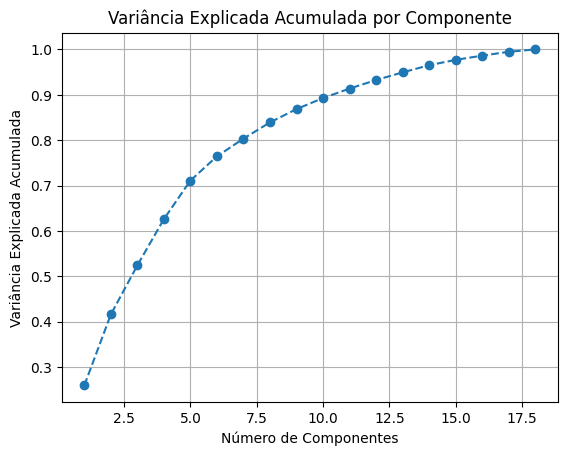
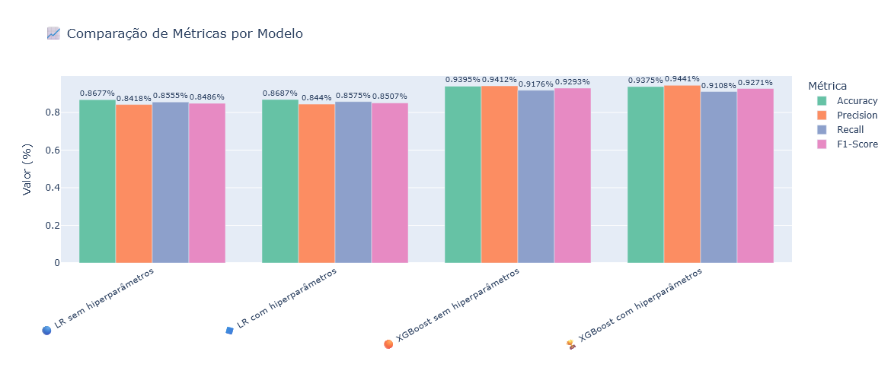
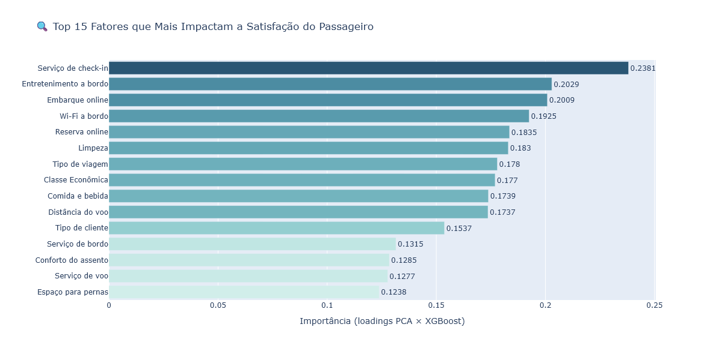

# ✈️ Predição de Satisfação de Passageiros Aéreos

> Modelo preditivo de satisfação de clientes em companhias aéreas, identificando os fatores críticos que determinam a experiência do passageiro — desenvolvido em parceria com a Semantix como projeto do curso Profissão Cientista de Dados (EBAC).

## 📋 Sumário

- [Nome do Projeto](#nome-do-projeto)
- [Contexto / Problema do Negócio](#contexto--problema-do-negócio)
- [Objetivo](#objetivo)
- [Estrutura do Projeto](#estrutura-do-projeto)
- [Coleta de Dados](#coleta-de-dados)
- [Modelagem](#modelagem)
- [Resultados](#resultados)
- [Conclusões e Próximos Passos](#conclusões-e-próximos-passos)
- [Pré-requisitos](#pré-requisitos)
- [Instalação](#instalação)
- [Contato](#contato)
- [Licença](#licença)


## Nome do Projeto

**Predição de Satisfação de Passageiros Aéreos: Análise de Fatores Comportamentais e Demográficos que Influenciam a Experiência do Cliente em Serviços de Aviação**

**Desenvolvido por:** Bruna S. R. Santos | **Iniciado em:** Novembro de 2025


## Contexto / Problema do Negócio

No setor de aviação comercial, a satisfação do passageiro é o principal indicador de sucesso e fidelização. Os dados do setor evidenciam a magnitude do problema:

- **89% dos passageiros trocam** de companhia aérea após uma experiência negativa
- Cada passageiro insatisfeito compartilha sua experiência com **15+ pessoas**
- O custo de aquisição de um novo cliente é **5–7× maior** do que reter um existente
- Atrasos de voo geram impacto econômico global de **bilhões de dólares/ano**

Em um mercado cada vez mais competitivo, companhias aéreas que não conhecem os fatores que predizem a insatisfação de seus clientes tomam decisões reativas e perdem passageiros para concorrentes. A ausência de modelos preditivos robustos impede que equipes de Customer Experience ajam antes que a insatisfação aconteça.

**A dor:** companhias aéreas coletam dados ricos de serviço e perfil de passageiro, mas raramente transformam esses dados em inteligência preditiva. O resultado são investimentos mal priorizados — melhorando serviços que pouco afetam a satisfação enquanto ignoram os que mais impactam.

Este projeto posiciona-se na interseção de:
- **Ciência de Dados Aplicada:** uso de ML para problema real de negócio
- **Customer Experience:** fundamentos de satisfação e comportamento do cliente
- **Analytics Prescritivo:** não apenas prever, mas recomendar ações


## Objetivo

1. **Prever o nível de satisfação** (Satisfeito vs. Neutro/Insatisfeito) com base em características demográficas, perfil de viagem e avaliações de serviço.
2. **Identificar os fatores mais críticos** que determinam a experiência do passageiro.
3. **Gerar recomendações prescritivas** — traduzir os achados em ações concretas para melhoria de serviço.
4. **Criar sistema de alerta** para intervenção proativa em passageiros com risco de insatisfação.
5. **Quantificar o impacto de atrasos** na satisfação em relação a outros fatores.

**Perguntas respondidas pelo projeto:**
- Quais serviços a bordo têm maior impacto na satisfação?
- Atrasos de voo são o principal fator de insatisfação ou existem fatores mais determinantes?
- Passageiros de qual perfil (classe, tipo de viagem, fidelidade) são mais propensos à insatisfação?
- Qual modelo de machine learning oferece melhor desempenho preditivo para este problema?


## Estrutura do Projeto

```
.
├── base/
│   └── train.csv                         # Dataset (Kaggle)
├── src/
│   ├── data_utils.py                     # Funções de tratamento e análise dos dados
│   ├── plot_utils.py                     # Funções de visualização reutilizáveis
│   └── model_utils.py                    # Pipelines, cross-validation e avaliação dos modelos
├── EBAC_Projeto_Semantix.ipynb           # Notebook principal com toda a análise
└── README.md
```


## Coleta de Dados

| Característica | Detalhe |
|---|---|
| **Fonte** | [Kaggle — Airline Passenger Satisfaction](https://www.kaggle.com/datasets/teejmahal20/airline-passenger-satisfaction) |
| **Volume** | ~103 mil registros × 25 variáveis |
| **Granularidade** | 1 linha por passageiro avaliado |
| **Variável alvo** | `satisfaction` — binária: `satisfied` / `neutral or dissatisfied` |
| **Balanceamento** | Leve desbalanceamento: ~57% neutro/insatisfeito / ~43% satisfeito |

### Principais variáveis

**Perfil do passageiro:**
`Gender`, `Customer Type` (Loyal / Disloyal), `Age`, `Type of Travel` (Business / Personal), `Class` (Business / Eco / Eco Plus)

**Operação do voo:**
`Flight Distance`, `Departure Delay in Minutes`, `Arrival Delay in Minutes`

**Avaliações de serviço (escala 1–5):**
`Inflight wifi service`, `Food and drink`, `Online boarding`, `Seat comfort`, `Inflight entertainment`, `On-board service`, `Leg room service`, `Baggage handling`, `Checkin service`, `Inflight service`, `Cleanliness`, `Ease of Online booking`

### Análise exploratória — principais observações

- Dataset equilibrado entre gêneros
- Predominância de clientes fiéis (*Loyal*) sobre não-fiéis (*Disloyal*)
- Maior concentração de viagens a trabalho (*Business Travel*)
- Classe Eco Plus com poucos registros em relação às demais
- Target levemente desbalanceado para neutro/insatisfeito

### Tratamento aplicado

- **Valores nulos:** `Arrival Delay in Minutes` preenchido com `0` (ausência de registro = sem atraso de chegada)
- **Tipagem:** variáveis categóricas convertidas para `str`; delays convertidos para `int64`
- **Outliers:** `Flight Distance`, `Departure Delay` e `Arrival Delay` analisados via IQR — valores mantidos por serem operacionalmente legítimos
- **Encoding:** `LabelEncoder` para binárias (`Gender`, `Customer Type`, `Type of Travel`, `satisfaction`); `get_dummies` com `drop_first=True` para `Class` (evitar multicolinearidade)
- **Seleção de features:** removidas 5 variáveis com baixa correlação com o target ou alta redundância: `Arrival Delay in Minutes` (correlação ~0.97 com `Departure Delay`), `Departure Delay in Minutes`, `Gender`, `Gate location` e `Departure/Arrival time convenient` — restando **18 features** para modelagem


## Modelagem

### Pipeline adotado

```
Dados brutos → Encoding → Seleção de features (18) → RobustScaler → PCA → SMOTE → Modelo → Avaliação
```

Todos os modelos foram encapsulados em **pipelines do scikit-learn/imblearn** com `RobustScaler` (robusto a outliers de delay), **PCA** para redução de dimensionalidade e **SMOTE** para balanceamento, avaliados via **StratifiedKFold com 5 folds**.

### Redução de dimensionalidade (PCA)

Análise exploratória com PCA sobre as 18 features selecionadas:

| Componentes | Variância Acumulada |
|---|---|
| 8 componentes | 90,57% ✅ ponto de inflexão |
| 13 componentes | ~95% |
| 18 componentes | 100% |

Os modelos foram treinados com `n_components=18` (sem redução), aproveitando a variância total do conjunto de features selecionadas.

### Variância Explicada pelo PCA



### Modelos treinados

| Modelo | Configuração | Otimização |
|---|---|---|
| Regressão Logística | Sem hiperparâmetros | StratifiedKFold 5 folds |
| Regressão Logística | Com hiperparâmetros | `GridSearchCV` — `C`, `max_iter`, `n_components`, `class_weight` |
| XGBoost | Sem hiperparâmetros | StratifiedKFold 5 folds |
| **XGBoost** | **Com hiperparâmetros** ⭐ | **`GridSearchCV` — `learning_rate`, `max_depth`, `n_estimators`, `subsample`, `colsample_bytree`** |

As predições finais foram geradas via `cross_val_predict`, garantindo que cada amostra fosse avaliada apenas nos folds em que não participou do treino.


## Resultados

### Comparativo de modelos

> ⭐ **Melhor modelo: XGBoost com hiperparâmetros**

| Modelo | Accuracy | Precision | Recall | F1-Score |
|---|---|---|---|---|
| Regressão Logística (sem hiper) | 86.77 | 84.18 | 85.55 | 84.86 |
| Regressão Logística (com hiper) | 86.78 | 84.20 | 85.54 | 84.87 |
| XGBoost (sem hiper) | 93.93 | 94.16 | 91.67 | 92.90 |
| **XGBoost (com hiper)** | **95.01** | **95.66** | **92.68** | **94.15** |

### Comparação Visual dos Modelos



### Matriz de Confusão — Melhor Modelo


### Importância das Variáveis no XGBoost



### Principais descobertas

> 💡 **Insight 1 — Serviços digitais lideram o impacto:** Embarque online e reserva online estão entre os fatores com maior peso na satisfação — a jornada digital do passageiro tem mais influência do que muitos serviços físicos tradicionais.

> 💡 **Insight 2 — Tipo de viagem é determinante:** Passageiros em viagens a trabalho apresentam maior taxa de satisfação, mas ainda abaixo do ideal — indicando que o serviço atual atende melhor o viajante corporativo, mas ainda deixa lacunas em ambos os perfis.

> 💡 **Insight 3 — Atrasos importam, mas não são o único fator:** Nenhum dos atrasos operacionais aparece entre os cinco primeiros determinantes da satisfação. Passageiros insatisfeitos em voos pontuais indicam que a **qualidade dos serviços** pesa mais do que a pontualidade isoladamente.

> 💡 **Insight 4 — Perfil etário:** Passageiros satisfeitos têm idade média em torno de **43 anos**; os insatisfeitos concentram-se em torno de **36 anos** — viajantes mais jovens apresentam expectativas distintas, especialmente em relação à conectividade e tecnologia.


## Conclusões e Próximos Passos

### Conclusão

O XGBoost com hiperparâmetros foi o modelo com melhor desempenho preditivo (accuracy de 95,01%). A análise revelou que a satisfação do passageiro é determinada por uma combinação de serviços presenciais e digitais. Os cinco fatores mais determinantes identificados pelo modelo (Feature Importance — XGBoost), em ordem de importância, são:

1. 🥇 **Serviço de check-in** — 0,2381
2. 🥈 **Entretenimento a bordo** — 0,2029
3. 🥉 **Embarque online** — 0,2009
4. **Wi-Fi a bordo** — 0,1925
5. **Reserva online** — 0,1835

O check-in — primeiro serviço presencial — define em grande parte a impressão geral da viagem. Os três serviços digitais (embarque online, Wi-Fi e reserva online) somam importância comparável à do check-in sozinho, reforçando que a jornada digital do passageiro é tão crítica quanto o atendimento presencial.

### Recomendações

**1. Serviços digitais (prioridade alta)**
- Conduzir análise de usabilidade (UX Research) do site e app para identificar gargalos na reserva e no embarque online
- Simplificar os fluxos com maior taxa de abandono e validar melhorias com testes A/B

**2. Check-in presencial (prioridade alta)**
- A satisfação com check-in só aparece de forma significativa quando avaliado com 5 estrelas — baixa tolerância a falhas
- Disponibilizar colaborador dedicado para orientar passageiros no check-in
- Ampliar totens de autoatendimento para reduzir filas e agilizar o processo
- Monitorar continuamente as avaliações para medir o impacto das melhorias

**3. Entretenimento e Wi-Fi (prioridade média)**
- Investir em sistemas de entretenimento embarcado nas rotas de média e longa distância
- Melhorar cobertura e velocidade do Wi-Fi, com planos acessíveis ou inclusão gratuita para passageiros frequentes
- Para viagens a trabalho, considerar pacotes de conectividade diferenciados (esse grupo usa Wi-Fi como ferramenta produtiva)
- Priorização estratégica: passageiros insatisfeitos concentram-se na faixa dos 36 anos — geração digitalmente ativa com alta dependência de conectividade

### Limitações

- O dataset é de origem pública e pode não refletir a realidade operacional de uma companhia específica
- O PCA reduz a interpretabilidade direta — as importâncias de feature são estimativas via loadings
- O modelo foi treinado com dados de uma única snapshot; sazonalidade e eventos externos não estão representados

### Próximos Passos

- [ ] Testar ensemble combinando XGBoost + Regressão Logística (stacking)
- [ ] Construir dashboard interativo em Streamlit ou Power BI com o modelo em produção
- [ ] Incluir dados de voos reais (ANAC) para validação externa
- [ ] Explorar segmentação com K-Means para identificar perfis de passageiro antes da modelagem supervisionada


## Pré-requisitos

- Python 3.10 ou superior
- pip ou conda


## Instalação

```bash
# Clone o repositório
git clone https://github.com/SantosBruna/PROJETO-PARA-CIENTISTA-DE-DADOS---EBAC-SEMANTIX.git
cd PROJETO-PARA-CIENTISTA-DE-DADOS---EBAC-SEMANTIX

# Crie um ambiente virtual
python -m venv venv
source venv/bin/activate   # Linux/Mac
# venv\Scripts\activate    # Windows

# Instale as dependências
pip install -r requirements.txt
```

**Principais dependências:**
```
pandas
numpy
scikit-learn
imbalanced-learn
xgboost
plotly
seaborn
matplotlib
kagglehub
```


## Contato

**Bruna S. R. Santos**
- 💼 [LinkedIn](https://www.linkedin.com/in/brunasrsantos)
- 📧 Email: brunasrsantos@gmail.com


## Licença

Este projeto está licenciado sob a licença MIT. Veja [LICENSE](LICENSE) para mais detalhes.
